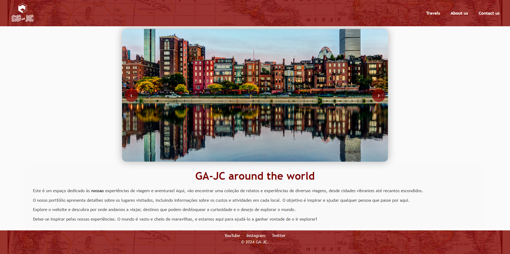
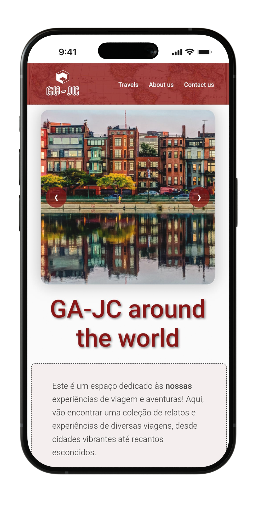
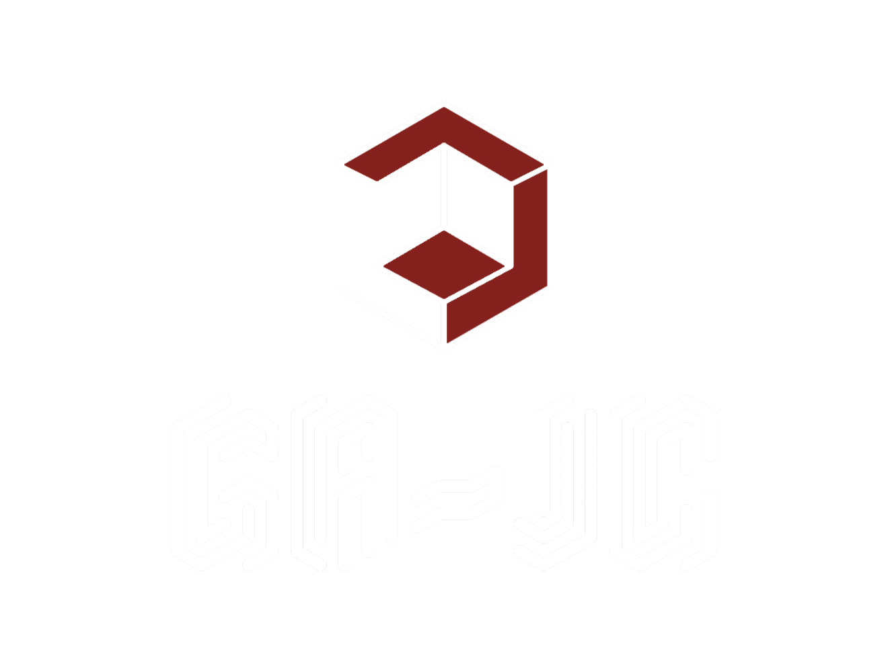

# tcm24twg04
# Portfólio de Experiências de Viagem

O projeto consiste em um website estilo portfólio digital sobre experiências de viagem. Temos como objetivo transmitir ao leitor informações e experiências de uma forma simples, e através de várias codificações semióticas, oferecer ao leitor determinados valores em cada elemento, criando uma harmonia entre o conteûdo e o design.

## Proposta de Projeto

| [Aceder à proposta](docs/Proposta.md) |
|:----------------------------------:|

## Repository Organization

- Code is in the `build` folder.
- Report chapters are in the `docs` folder.

| [Aceder à sub-pasta /build](build/) |
|:----------------------------------:|
| [Aceder ao Relatório](docs/Relatório.md) |

## Gallery

| Index Desktop |  |
|-------|-------|
| Index Mobile |  |
| GA-JC |  |

## Report
- located in the `docs` folder

### Project Presentation – Apresentação do projeto
- Chapter 1: [Proposta](docs/C1.md)
- Chapter 2: [Descrição](docs/C2.md)

### User Interface – Interface com o utilizador

- Chapter 3: [Organização](docs/C3.md)

### Product - Produto

- Chapter 4: [Configuração](docs/C4.md)
- Chapter 5: [Validação](docs/C5.md)
- Chapter 6: [Implementação](docs/C6.md)

## Technologies

- [XML](https://www.w3schools.com/xml/)
- [HTML5](https://www.w3schools.com/html/html5_intro.asp) + [CSS3](https://www.w3schools.com/css/css_intro.asp)
- [JavaScript](https://www.w3schools.com/js/)
- [XML](https://www.w3schools.com/xml/)

### Team
- Guilherme Andrade [@adr-g](https://github.com/adr-g)
- Jonathan Claro [@JonathanClaro](https://github.com/JonathanClaro)
