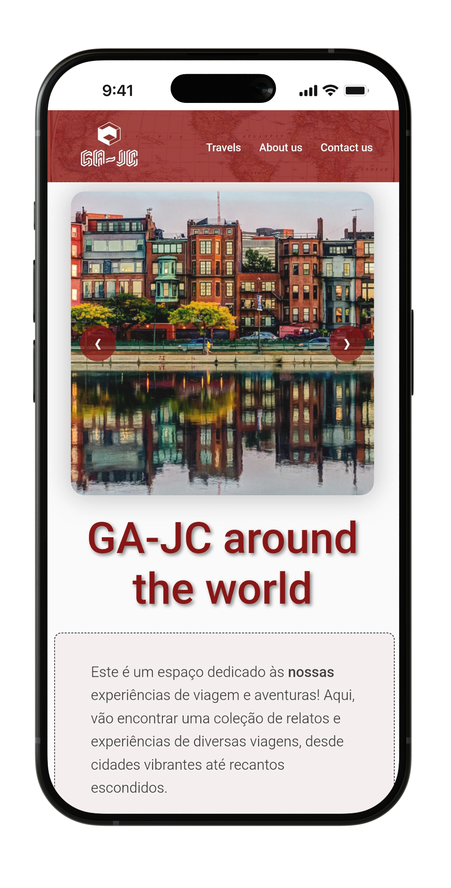

# Chapter 3
---
# Organização

- O nosso approach ao desenvolvimento deste website for sinceramente simples, a nossa ideia seria uma "caixa" que tivesse a conter o conteúdo.
- Começamos por avaliar como podemos facilmente criar uma relação entre o mobile e o desktop, para que ao imaginar o design do website, fosse possível realacionar os dois de forma fácil.

## Sketch

- No brainstorm inicial do projeto fomos desenvolvendo várias ideias para o projeto, e à medida que iamos implementando algumas funcionalidades, iamos modificando o projeto.
- Acabamos com uma série de sketch primários que foram a base do projeto e criamos versões tanto mobile como para desktop.

| Sketch |
|-------|
|  |

### Relação com produto final

- De modo geral, seguimos as propostas que criamos nos sketches.
- Nos sketches, inicialmente tinhamos implementado elementos que não ficaram para o final do projeto. Exemplo disto seria o menu Sandwich   da nav, que se resumiu a uma escolha estética. Não gostamos da falta de presença da lista de nav no header.
- Em contaste com essa decisão, fizemos um menu dropdown com uma essência parecida, para dar acesso aos destinos.

| Desktop | Mobile |
|-------|-------|
|  |  |

## Mapa de Website

- Após o desenvolvimento do projeto, criamos o Mapa de Website que indica a ligação entre páginas no mesmo.

| Mapa de Website |
|-------|
|  |

---

| [< Previous](C2.md) | [^ Main](../README.md) | [Next >](C4.md) |
|:----------------------------------:|:----------------------------------:|:----------------------------------:|
