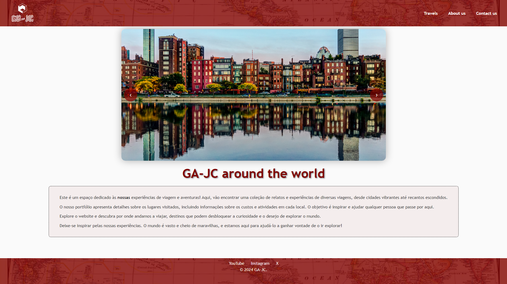

# Chapter 3
# Organização

- O nosso approach ao desenvolvimento deste website for sinceramente simples, a nossa ideia seria uma "caixa" que tivesse a conter o conteúdo.
- Começamos por avaliar como podemos facilmente criar uma relação entre o mobile e o desktop, para que ao imaginar o design do website, fosse possível realacionar os dois de forma fácil.

## Wireframes

- Criamos uma versão (mobile/desktop) de wireframes para o website, na algura do seu desenvolvimento serviram apenas como guias de base para o desenvolvimento do website. Acabaram por ser essas guias que definiram a estrutura do mesmo.

| Wireframes |
|-------|
|  |

### Relação com produto final

| Desktop | Mobile |
|-------|-------|
|  |  |

## Mapa de Website

- Após o desenvolvimento do projeto criamos o Mapa de Website que indica a ligação entre páginas no mesmo.

| Mapa de Website |
|-------|
|  |

| [< Previous](C2.md) | [^ Main](../README.md) | [Next >](C4.md) |
|:----------------------------------:|:----------------------------------:|:----------------------------------:|
