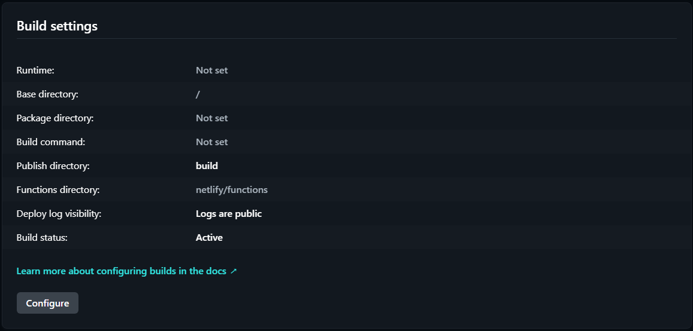
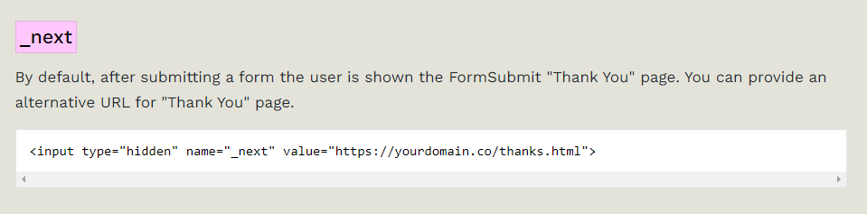

# Chapter 4
---
# Configuração

## Descrição do Produto
O website "GA-JC around the world" é um portefólio digital que documenta experiências de viagem, oferecendo relatos simples e dicas das viagens. O objetivo é inspirar e auxiliar viajantes, fornecendo detalhes sobre locais visitados, custos e atividades.

## Instruções de Instalação e Configuração

Este projeto está "LIVE" com recurso à plataforma Netlify.
Através da criação de um projeto com acesso ao reportório do GitHub, a plataforma Netlify dá deploy automaticamente aos ficheiros presentes no repositório (main@HEAD).

Depois de alguns problemas a tentar dar organizar o repositório e mantendo o deploy funcional conseguimos resolver o problema que tinhamos inicalmente nos deparado com, por isso,  atualmente o Netlify dá deploy apenas à pasta /build. 

O Netlify inicialmente não dava deploy a qualquer ficheiro que estivesse numa sub-folder, nós, querendo evitar que o repositório ficasse desorganizado conseguimos mudar nas definições de deploy para que a plataforma apenas fosse ler o código da sub-folder.

| Build Settings |
|-------------------|
|  |

## Regras de Utilização

O site é de acesso público, não requerendo autenticação para navegação. Os utilizadores podem explorar livremente os conteúdos disponíveis.

## Ajuda à Navegação

A navegação é facilitada por um menu principal com as seguintes seções:

- Travels: Subdividido em destinos específicos, como Boston e Mónaco.

- About us: Informações sobre os autores do site.

- Contact us: Formulário para contato direto.

### Menu Dropdown Interativo
Para melhorar a usabilidade, foi criado um menu **dropdown** que permite ao leitor selecionar rapidamente os destinos disponíveis. Este menu torna a navegação entre páginas mais intuitiva e ajuda a organizar o conteúdo do nav do site.

| Ex. Dropdown menu   |
|--------------------------|
|  |

## Validações de Formulários

A validação do formulário presente no website é feita com auxílio de **https://formsubmit.co/**, que sem ser necessário me registrar no website, permite o recurso aos servidores deles.
Desta maneira consigo receber por email os dados de todas as validações do formulário.

Além disso, tirei proveito duma "Advanced Feature" oferecida, para redirecionar o utilizador do website para a página **Thanks** logo a seguir a preencher com sucesso o formulário.

| Ex. Dropdown menu   |
|--------------------------|
|  |

---

| [< Previous](C3.md) | [^ Main](../README.md) | [Next >](C5.md) |
|:----------------------------------:|:----------------------------------:|:----------------------------------:|
