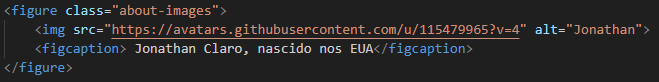
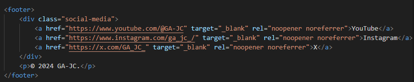
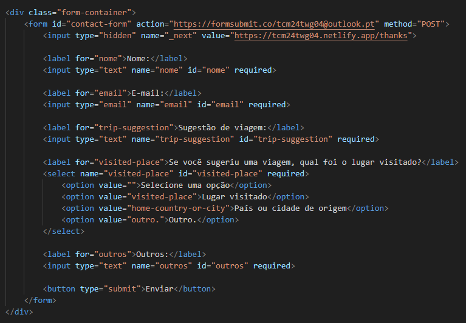
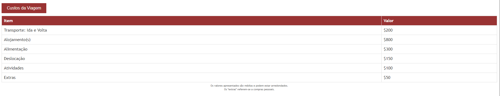
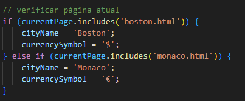
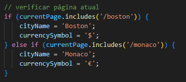

# Chapter 6
# Implementação

- Detalhes de implementação (demonstrar o cumprimento dos objetivos mínimos e outros
detalhes relevantes da implementação)

| Área Temática: “Viagens” |  |
|-------|-------|
| 4 páginas HTML estáticas |  |
| Documento XML e Schema |  |
| Marcação Semântica HTML |  |
| Tabela |  |
| Listas |  |
| Marcação de Texto |  |
| Imagens |  |
| Ligações |  |
| Formulário |  |

# Extras

## 1. Galeria de Imagens Dinâmica
Uma das principais funcionalidades do projeto é a galeria de imagens, presente em:
- **index.html**
- **monaco.html**
- **boston.html**

| Ex. Galeria |
|--------------------------|
|  |

Esta galeria permite que o utilizador navegue pelas imagens escolhidas usando botões de navegação (“Próx” e “Ant”). A implementação utiliza **JavaScript** para:
- Rotacionar as imagens dinamicamente;
- Atualizar a exibição da imagem com base na interação do utilizador.

## 2. Menu Dropdown Interativo
Para melhorar a usabilidade, foi criado um menu **dropdown** que permite ao leitor selecionar rapidamente os destinos disponíveis. Este menu torna a navegação entre páginas mais intuitiva e ajuda a organizar o conteúdo do nav do site.

| Ex. Dropdown menu   |
|--------------------------|
|  |

## 3. Botão "Load Costs"
Outra funcionalidade relevante é o botão **"loadCostsBtn"**, que está integrado para:
- Criar uma tabela com informações sobre custos associados aos destinos;
- Mostrar ou esconder essa tabela conforme a necessidade do utilizador.

| Ex. Botão e Tabela   |
|--------------------------|
|  |

A população da tabela é feita utilizando **JavaScript**, que realiza uma requisição ao ficheiro `custos.xml`. O script interpreta os dados no formato XML e os insere dinamicamente no HTML, proporcionando uma solução elegante para apresentar informações adicionais sem recarregar a página.

### Problemas Durante o Deploy
Durante o processo de deploy, surgiram problemas relacionados ao funcionamento do botão "Load Costs". Localmente, a funcionalidade operava sem erros, mas, no deploy, surgiram problemas ao tentar carregar o ficheiro XML. 

Através da inserção de diversos **console.logs** em pontos estratégicos do código, foi possível identificar que o URL estava a ser interpretado de forma incorreta como `https://tcm24twg04.netlify.app/boston.html` em vez de `https://tcm24twg04.netlify.app/boston`. A correção envolveu ajustar o código para lidar com URLs de maneira adequada no ambiente de produção.

| Pre Fix Botão   | After Fix Botão   |
|-------------------|-------|
|  |  |

| [< Previous](C5.md) | [^ Main](../README.md) | [Next >](C7.md) |
|:----------------------------------:|:----------------------------------:|:----------------------------------:|
