# Chapter 6
---
# Implementação

- Detalhes de implementação (demonstrar o cumprimento dos objetivos mínimos e outros
detalhes relevantes da implementação)

| Área Temática: “Viagens” |  |
|-------|-------|
| 4 páginas HTML estáticas |  |
| Documento XML e Schema |  |
| Marcação Semântica HTML |  |
| Tabela |  |
| Listas |  |
| Marcação de Texto |  |
| Imagens |  |
| Ligações |  |
| Formulário |  |
| Seletores Simples | 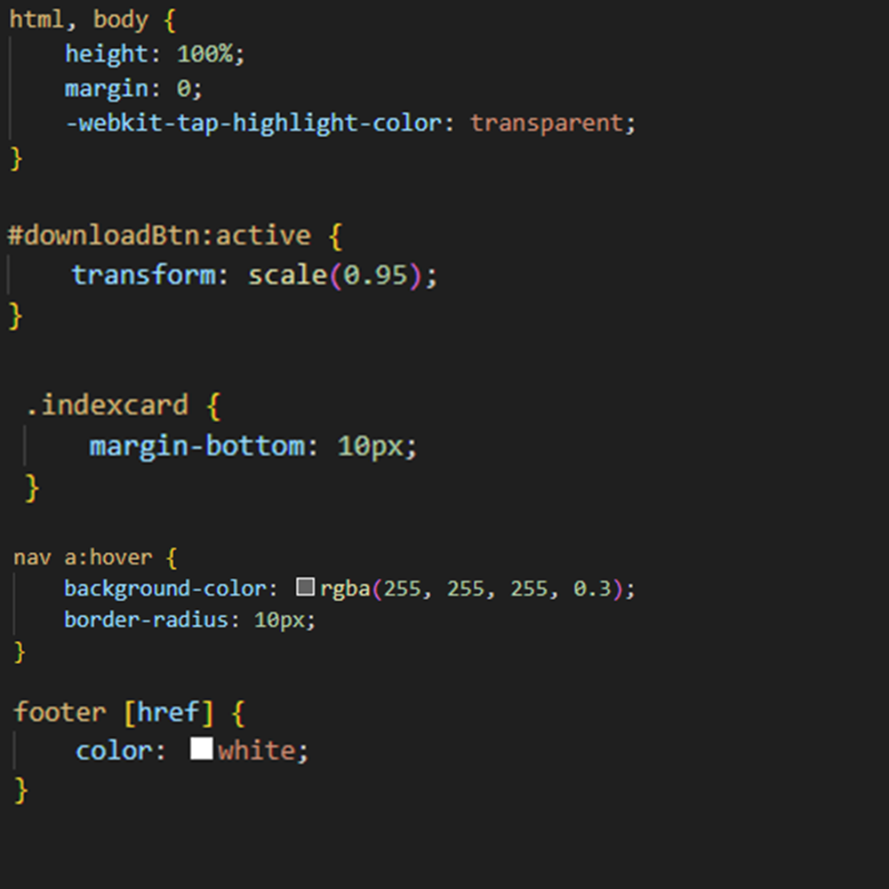 |
| Seletor de Pseudo-elementos e Seletor Combinador | 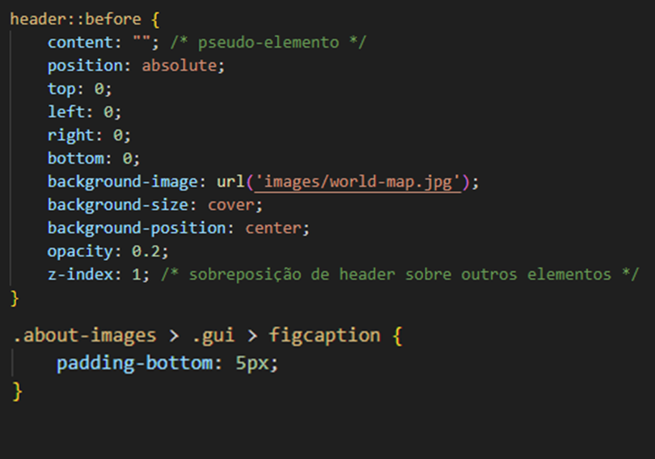 |
| Propriedades do Texto e da Fonte | 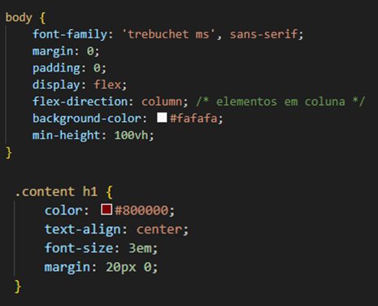 |
| Formatação do Fundo de Página | 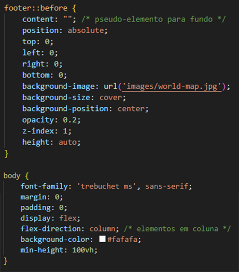 |
| Formatação de Estilo para uma Lista | 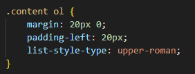 |
| Manipulação dos 4 Elementos de Formatação da Caixa de Elementos HTML | 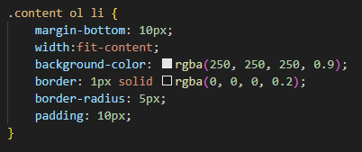 |
| Utilização de Propriedades de Flutuação, de Posicionamento e Combinadas | 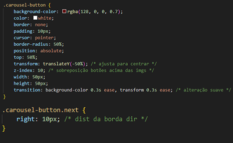 |
| Esconder um Elemento | 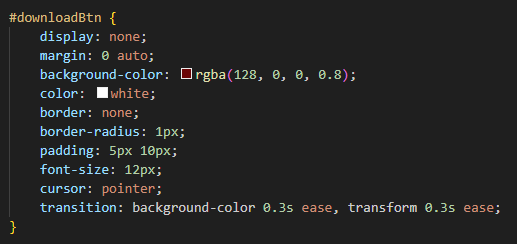 |
| Formatação de uma Tabela | 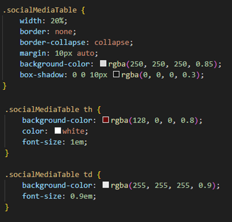 |
| Substituição de um Elemento por uma Imagem | 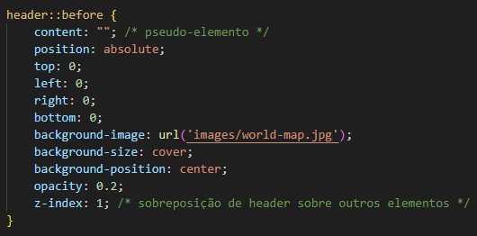 |
| Responsividade para Duas Dimensões de Ecrã (Media Queries) | 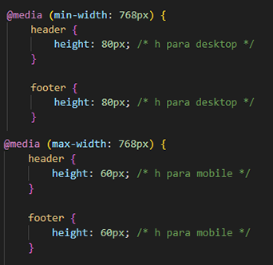 |

## Extras

### 1. Galeria de Imagens
Uma das principais funcionalidades do projeto é a galeria de imagens, presente em:
- **index.html**
- **monaco.html**
- **boston.html**

| Ex. Galeria |
|--------------------------|
|  |

A galeria permite que o utilizador navegue pelas imagens escolhidas usando botões de navegação (“Próx” e “Ant”). A implementação da mesma utiliza **JavaScript** para:
- Ativar a rotação das imagens e criar um loop das mesmas;
- Atualizar a exibição da imagem com base a interação do próprio utilizador.

### 2. Menu Dropdown Interativo
Criamos um menu **dropdown** que permite ao utilizador selecionar rapidamente os destinos disponíveis.

| Ex. Dropdown menu   |
|--------------------------|
|  |

### 3. Botão "Load Costs"
Outra funcionalidade relevante é o botão **"loadCostsBtn"**, que:
- Dá e tira visibilidade a uma tabela com informações sobre custos associados aos destinos;

| Ex. Botão e Tabela   |
|--------------------------|
| 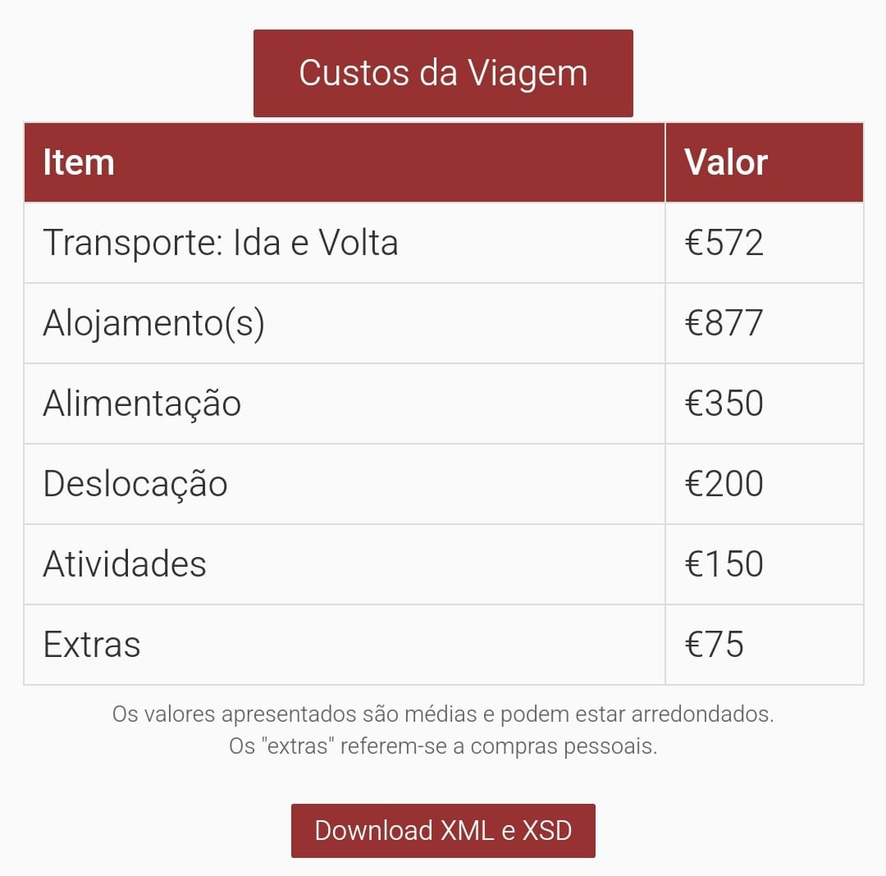 |

Os dados da tabela são implementados com recurso a **JavaScript**, que realiza uma requisição ao ficheiro `custos.xml`. O script interpreta os dados do ficheiro **XML** e implementa-os no **HTML**.

#### Problemas Durante o Deploy
Durante o processo de deploy, surgiram problemas relacionados ao funcionamento do botão "Load Costs".
Localmente, a funcionalidade operava sem erros, mas, no deploy, surgiram problemas ao implementar os dados na tabela. 

Através da criação de diversos **console.logs** no script, foi possível identificar que o URL estava a ser interpretado de forma incorreta, como `https://tcm24twg04.netlify.app/boston.html` em vez de `https://tcm24twg04.netlify.app/boston`. A correção resumiu-se a ajustar o código para lidar com os URLs de maneira correta.

| Pre Fix Botão   | After Fix Botão   |
|-------------------|-------|
|  |  |

---

| [< Previous](C5.md) | [^ Main](../README.md) | [Next >](C7.md) |
|:----------------------------------:|:----------------------------------:|:----------------------------------:|
