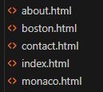
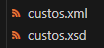
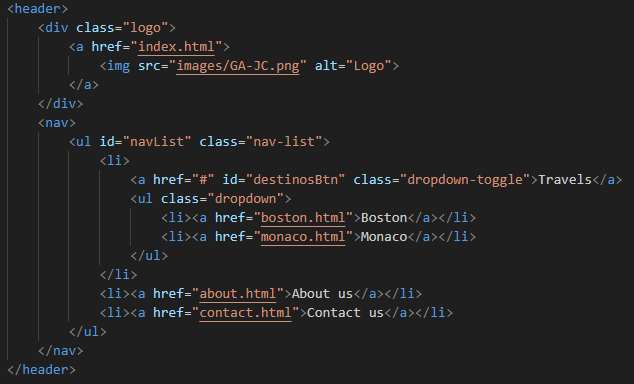
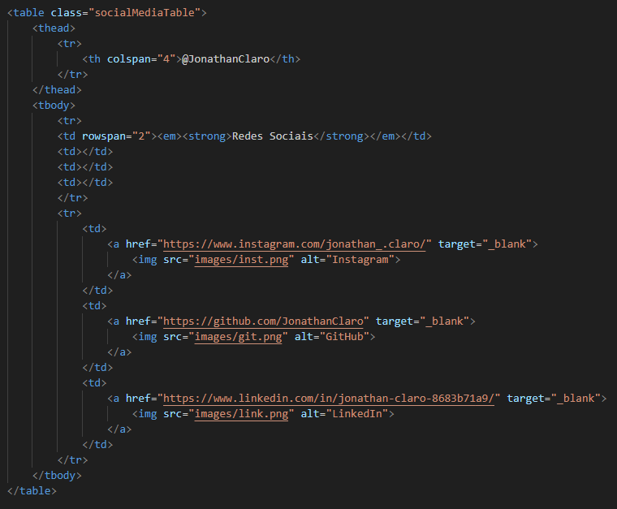
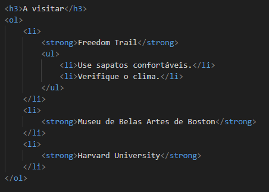
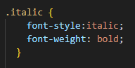

# Chapter 6
# Implementação

- Detalhes de implementação (demonstrar o cumprimento dos objetivos mínimos e outros
detalhes relevantes da implementação)

| 4 páginas HTML estáticas |  |
|-------|-------|
| 1 documento XML e respetivo schema para validação |  |
| Marcação semântica do conteúdo |  |
| Tabela com utilização de elementos/atributos thead, tbody, tfoot e rowspan e colspan |  |
| Listas (ordenada, não ordenada, definições) com pelo menos uma lista aninhada |  |
| Marcação correta de texto com destaque (uso de elemento em, strong, mark, …) com alteração da formatação padrão através de CSS |  |

| [< Previous](C5.md) | [^ Main](../README.md) | [Next >](C7.md) |
|:----------------------------------:|:----------------------------------:|:----------------------------------:|
